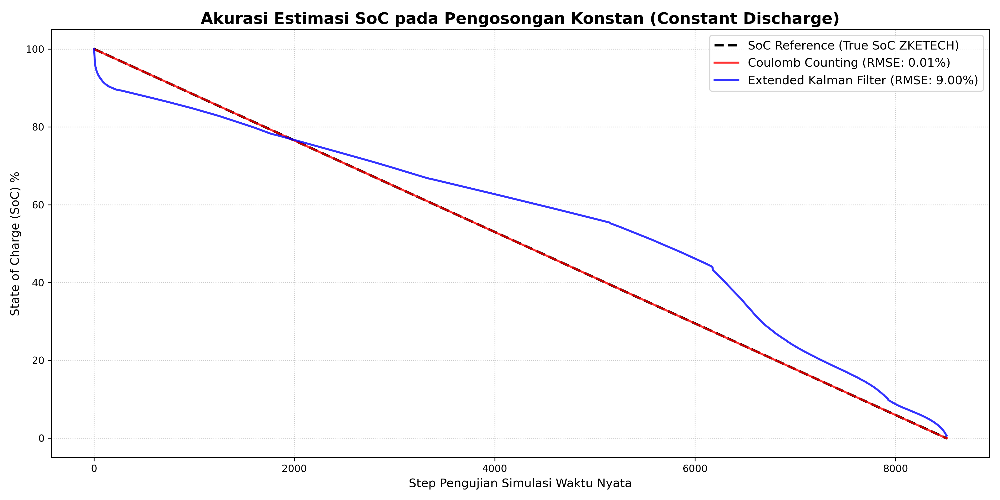
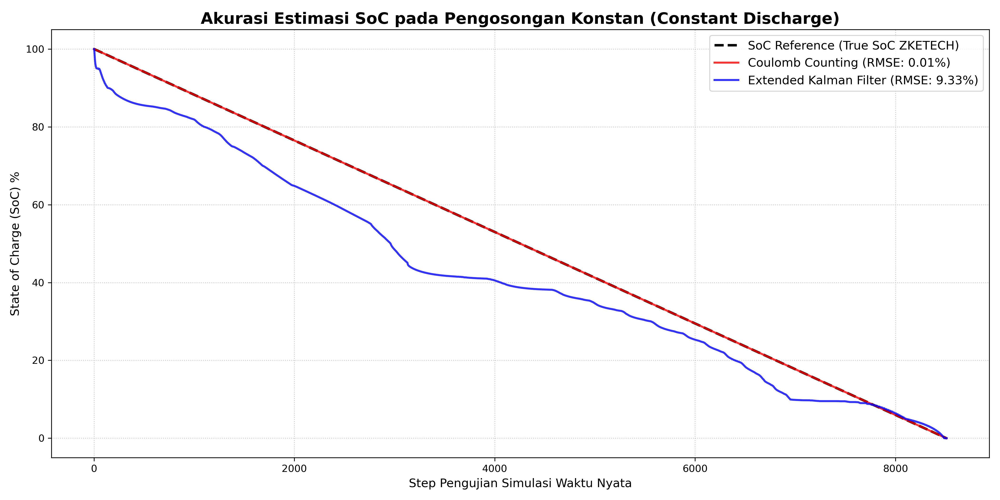
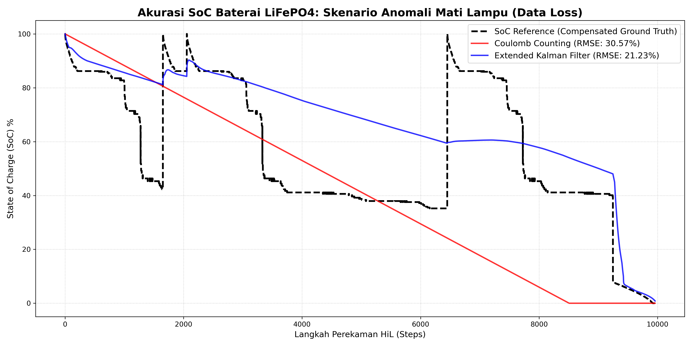

## Skenario 2: Pengosongan Konstan (Slow Discharge)

Pengujian ini bertujuan untuk mengevaluasi performa algoritma **Extended Kalman Filter (EKF)** dan membandingkannya dengan metode **Coulomb Counting (CC)** selama proses pengosongan daya baterai. Skenario ini menjadi *baseline* performa baterai tanpa dinamika tegangan yang ekstrem.

### Detail Pengujian
* **Metode:** Arus konstan 4.4A (C-rate rendah ~0.2C) hingga kosong.
* **Dataset:** `DCC 4.4A, 2.5V.csv`
* **Tujuan Eksperimen:**
    1. Menguji akurasi EKF dan CC saat fasa pengosongan konstan sebagai *baseline*.
    2. Mengobservasi dampak kehilangan data telemetri (anomali jaringan) terhadap estimasi SoC dari kedua metode.

---

## Ringkasan Output Skenario 2 `Analisa_RMSE.ipynb`

### Versi 1 (v1) - Tuning Parameter ESP32

Pada tahap ini, digunakan 10 titik pemetaan untuk *Look-Up Table* (LUT) OCV-SoC.

**Parameter:**
```cpp
// 10 titik (interval 5%) dari Cubic Spline Ground Truth
const int LUT_OCV_SIZE = 10;
const float lut_soc_ocv[LUT_OCV_SIZE] = {
    0.0, 0.098849, 0.212431, 0.326001, 0.439511,
    0.553234, 0.667017, 0.780667, 0.894377, 1.0};
const float lut_ocv[LUT_OCV_SIZE] = {
    2.655, 3.194, 3.223, 3.253, 3.282,
    3.288, 3.289, 3.297, 3.326, 3.537};

// TUNING NOISE PARAMETER
const float Q_NOISE_00 = 1e-6;
const float Q_NOISE_11 = 1e-4;
const float R_NOISE = 2e-4;
```

**Hasil Kalkulasi Root Mean Square Error (RMSE) v1**
=========================================
* **RMSE Metode Coulomb Counting:** 0.0059 %
* **RMSE Algoritma EKF:** 9.0011 %

---


### Versi 2 (v2) - Tuning Parameter ESP32

Pada iterasi kedua, jumlah titik LUT ditingkatkan menjadi 21 titik untuk resolusi yang lebih baik, dan nilai OCV dimodifikasi agar selalu naik secara monoton.

**Catatan Penting v2:** Nilai OCV disesuaikan agar selalu memiliki gradien positif (monotonik naik). Ini sangat penting agar turunan `dOCV/dSOC` (pembentuk Matriks H pada EKF) tidak pernah bernilai nol.

**Parameter:**
```cpp
// Diperbarui menjadi 21 titik (interval 5%) dari Cubic Spline Ground Truth
const int LUT_OCV_SIZE = 21;
const float lut_soc_ocv[LUT_OCV_SIZE] = {
    0.00, 0.05, 0.10, 0.15, 0.20,
    0.25, 0.30, 0.35, 0.40, 0.45,
    0.50, 0.55, 0.60, 0.65, 0.70,
    0.75, 0.80, 0.85, 0.90, 0.95, 1.00};

// Nilai OCV disesuaikan agar selalu memiliki gradien positif (monotonik naik)
// Sangat penting agar dOCV/dSOC (Matriks H) tidak pernah bernilai nol
const float lut_ocv[LUT_OCV_SIZE] = {
    2.655, 3.050, 3.194, 3.210, 3.220,
    3.232, 3.245, 3.258, 3.270, 3.282,
    3.285, 3.287, 3.288, 3.289, 3.291,
    3.294, 3.300, 3.310, 3.331, 3.385, 3.537};

// TUNING NOISE PARAMETER
const float Q_NOISE_00 = 1e-5;
const float Q_NOISE_11 = 1e-5;
const float R_NOISE = 1e-3;
```

**Hasil Kalkulasi Root Mean Square Error (RMSE) v2**
=========================================
* **RMSE Metode Coulomb Counting:** 0.0059 %
* **RMSE Algoritma EKF:** 9.3331 %

---


### Versi 3 (v3) - Anomali Koneksi (Data Drop / Mati Lampu)

Pada pengujian ini, terjadi anomali sistem yang tidak terduga di mana koneksi Wi-Fi terputus, menyebabkan koneksi MQTT terputus dan terjadi kehilangan data (*data drop*). Hal ini mengakibatkan terjadinya *drift* yang sangat signifikan pada kalkulasi SoC menggunakan metode *Coulomb Counting*.

**Parameter:**
```cpp
// Menggunakan LUT 21 titik yang sama dengan v2.
// Bagian yang diubah hanya TUNING NOISE PARAMETER
const float Q_NOISE_00 = 1e-5;
const float Q_NOISE_11 = 1e-5;
const float R_NOISE = 1e-3;
```

**Hasil Kalkulasi Root Mean Square Error (RMSE) v3**
=========================================
* **RMSE Metode Coulomb Counting:** 30.5686 %
* **RMSE Algoritma EKF:** 21.2266 %

---
