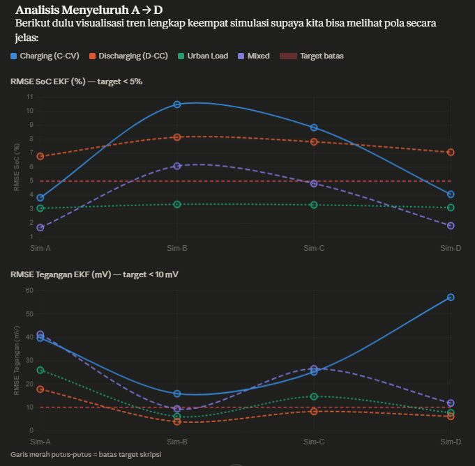

# Kesimpulan dari Grafik & Rekomendasi Simulasi-E

### Pola yang Sangat Jelas Terbaca dari 4 Simulasi:


Ada konflik fisika yang fundamental antara **RMSE SoC Charging** vs **RMSE Tegangan Charging** — keduanya tidak bisa diperbaiki bersamaan dengan satu set parameter statis. 

* **Saat $R$ dikecilkan (mempercayai sensor $V$):** RMSE $V$ Charging meledak karena pada fase CC-CV tegangan terminal bervariasi ekstrem sementara model $R_0$ tidak membedakan arah arus.
* **Saat $R$ diperbesar:** SoC Charging aman tapi RMSE $V$ rusak.

### Skenario yang Mendekati/Mencapai Target:
* **Urban Load SoC:** Selalu < 5% di semua simulasi ✅
* **Discharging RMSE V:** Sudah < 10mV mulai Sim-B ✅
* **Charging SoC:** Hanya Sim-A (3.82%) dan Sim-D (4.06%) yang lolos ✅
* **Kesimpulan:** Tidak ada satupun simulasi yang lolos semua kriteria sekaligus dengan parameter statis.

**Root Cause:** Model ECM dengan $R_0$ tunggal secara fisik tidak cukup untuk merepresentasikan *charging*. Ini bukan kegagalan tuning, melainkan batasan model (model limit).

---

## Parameter Simulasi-E: Pendekatan Adaptive $R$
Ini adalah perubahan arsitektur kecil yang krusial — bukan sekadar ganti angka. Implementasikan $R$ adaptif berdasarkan arah arus di dalam loop EKF:

```python
# Di dalam fungsi EKF, sebelum tahap update:
if I_meas < 0:  # fase charging (arus masuk = negatif)
    R_eff = 0.04   # percayai model lebih, kurangi koreksi agresif
else:           # fase discharging / urban
    R_eff = 0.008  # percayai sensor lebih
    
```

### Usulan Parameter Noise (Sim-E):
* **Q_NOISE_00:** `1e-7` (diambil dari Sim-A/D yang terbukti baik untuk SoC Charging)
* **Q_NOISE_11:** `2e-4` (cukup fleksibel untuk $V_{c1}$ menyerap error ECM)
* **R_discharge:** `0.008` (sedikit lebih kecil dari Sim-D)
* **R_charge:** `0.04` (mendekati Sim-A yang berhasil di SoC Charging)
* **P_init:** `0.01` (tetap dari Sim-A/C yang paling stabil)

**Reasoning:** Sim-A bagus untuk SoC Charging tapi RMSE $V$ buruk. Sim-D bagus untuk RMSE $V$ Discharging tapi RMSE $V$ Charging meledak. Solusinya: gunakan dua nilai $R$ sesuai kondisi operasi. Ini adalah pendekatan standar yang digunakan di literatur BMS komersial.

---

## Analisis & Validasi Keilmuan
Saran tersebut sangat brilian dan tepat sasaran secara keilmuan. Dalam industri **Battery Management System (BMS)**, mengadopsi *Adaptive Measurement Noise* ($R$) atau memisahkan tabel $R_0$ menjadi $R_{charge}$ dan $R_{discharge}$ adalah standar yang wajib dilakukan, khususnya untuk sel **LiFePO4**.

Karakteristik elektrokimia baterai saat menerima arus masuk (charge) dan melepas arus (discharge) memiliki impedansi yang berbeda. Dengan membedakan nilai $R$, Anda memberikan instruksi spesifik pada filter EKF:

* **Saat Charge ($R$ besar):** "Jangan terlalu percaya sensor tegangannya karena sedang bervariasi ekstrem, percayalah pada integrasi coulomb (model)."
* **Saat Discharge ($R$ kecil):** "Tegangan terminalnya sangat stabil mewakili baterai, ikuti sensornya secara ketat."

Ini akan menjadi nilai tambah yang sangat besar (poin plus) untuk skripsi Anda, karena menunjukkan pemahaman mendalam tentang batasan model **ECM 1-RC** dan bagaimana menyelesaikannya dengan adaptasi **Kalman Gain**.