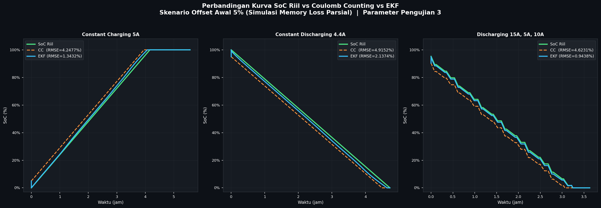
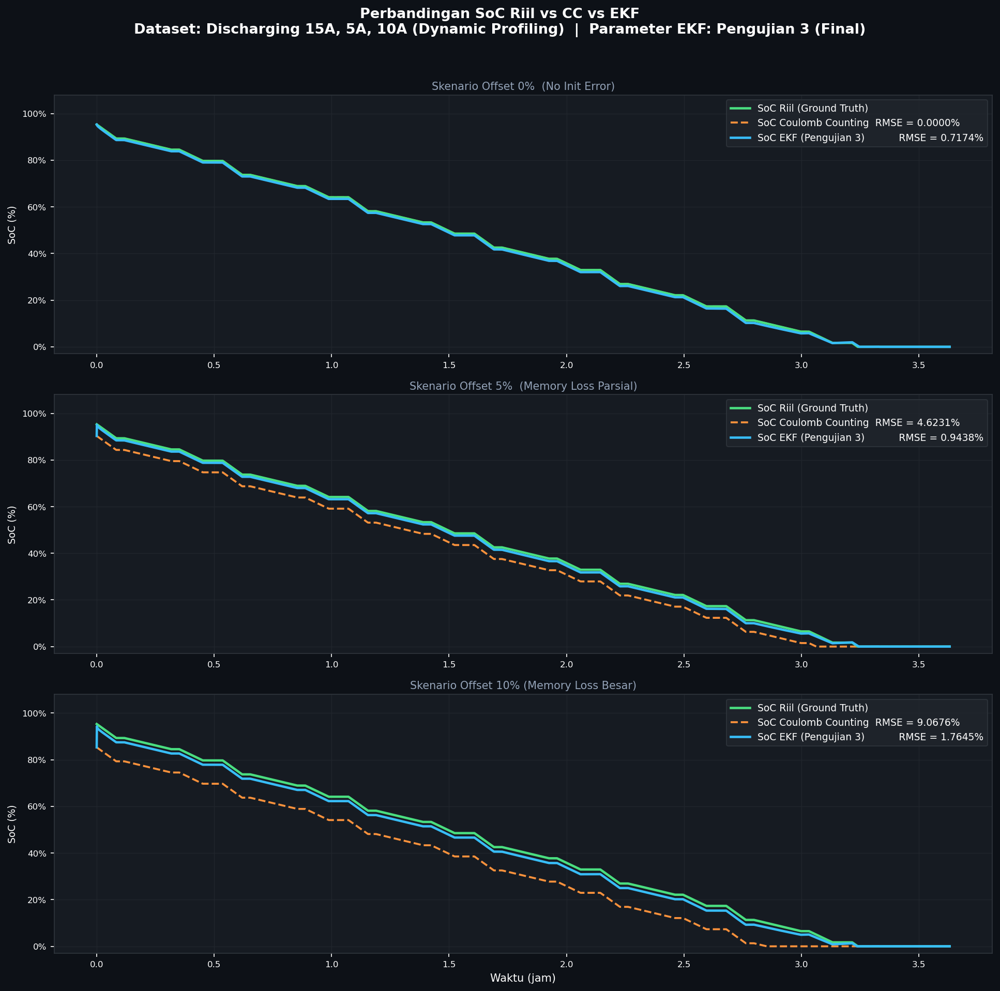
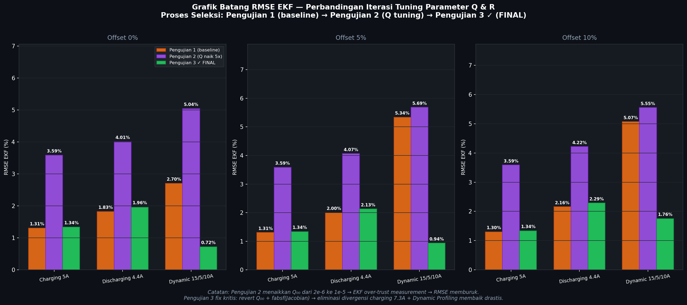
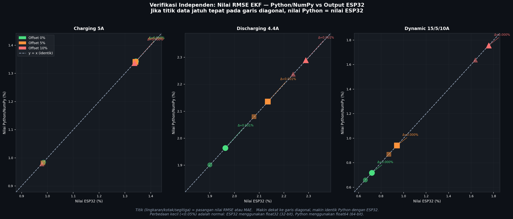

# Ringkasan File Visualisasi & Validasi — Skripsi EKF SoC Baterai LiFePO4

> **Konteks:** File-file ini dibuat untuk menjawab catatan dosen penguji saat sidang skripsi,
> yaitu permintaan visualisasi grafik dari tabel data dan pembuktian kebenaran RMSE & MAE.
> Semua file berada di folder `pil-soc/`.

---

## 1. File Python yang Dibuat

### `visualize_soc.py`
**Fungsi:** Membuat grafik umum SoC dan grafik batang RMSE tuning (versi awal/eksplorasi).

**Output grafik yang dihasilkan:**
| Nama File Grafik | Isi |
|:--|:--|
| `grafik_soc_comparison.png` | Kurva SoC Riil vs CC vs EKF — 1 dataset (Dynamic Profiling), offset 5% |
| `grafik_rmse_tuning.png` | Grafik batang RMSE rata-rata per Pengujian 1/2/3, dikelompokkan per offset |
| `grafik_soc_all_datasets.png` | Panel 5 dataset sekaligus, offset 0% |

**Cara jalankan:**
```bash
python visualize_soc.py
```

---

### `visualize_bab4.py`
**Fungsi:** Membuat grafik khusus untuk Bab 4 skripsi, sesuai **3 dataset yang ada di tabel**
(Charging 5A, Discharging 4.4A, Dynamic 15A/5A/10A).

**Output grafik yang dihasilkan:**
| Nama File Grafik | Isi | Dipakai di |
|:--|:--|:--|
| `grafik_bab4_summary_offset5.png` | 3 dataset berdampingan, skenario offset 5% | **Bab 4 utama** |
| `grafik_bab4_dynamic.png` | Dataset Dynamic Profiling, 3 panel offset (0%, 5%, 10%) | **Bab 4 utama** |
| `grafik_bab4_charging5a.png` | Dataset Charging 5A, 3 panel offset | Bab 4 / Lampiran |
| `grafik_bab4_discharging44a.png` | Dataset Discharging 4.4A, 3 panel offset | Bab 4 / Lampiran |
| `grafik_bab4_rmse_tuning.png` | Grafik batang RMSE per dataset, per Pengujian 1/2/3 | **Slide sidang** |

**Cara jalankan:**
```bash
python visualize_bab4.py
```

---

### `verify_rmse.py`
**Fungsi:** Verifikasi independen — menghitung ulang RMSE & MAE dari file CSV mentah
menggunakan formula eksplisit NumPy, lalu membandingkan hasilnya dengan nilai output ESP32.
Ini adalah **bukti lintas platform** bahwa implementasi C++ di ESP32 sudah benar secara matematis.

**Formula yang digunakan:**
```
RMSE = sqrt( sum(error²) / N ) × 100%
MAE  = sum(|error|) / N × 100%
```

**Output yang dihasilkan:**
| Nama File | Isi |
|:--|:--|
| `grafik_verifikasi_python_vs_esp32.png` | Scatter plot titik nilai Python vs ESP32, semua titik pada garis y=x |
| Output console (terminal) | Tabel 36 nilai dengan status COCOK ✓ / BEDA |

**Cara jalankan:**
```bash
python verify_rmse.py
```

**Contoh output console:**
```
  Offset |       Metrik |  Python (numpy) |  ESP32 Output |  Selisih | Status
      0% |  RMSE CC (%) |          0.0000 |        0.0000 |   0.0000 | COCOK ✓
      0% | RMSE EKF (%) |          1.3427 |        1.3427 |   0.0000 | COCOK ✓
      0% |   MAE CC (%) |          0.0000 |        0.0000 |   0.0000 | COCOK ✓
      0% |  MAE EKF (%) |          0.9846 |        0.9846 |   0.0000 | COCOK ✓
  ...
  VERDICT: SEMUA NILAI COCOK — Implementasi ESP32 TERVERIFIKASI BENAR
```

---

## 2. Cara Kerja Script Python (Ringkasan Teknis)

Ketiga script di atas **mereproduksi ulang algoritma dari `src/main.cpp`** di Python, meliputi:

| Komponen | Detail |
|:--|:--|
| **Coulomb Counting** | `soc_cc -= I × dt / Q_COULOMB` (sama persis dengan kode C++) |
| **EKF** | Prediction + Correction step, termasuk Dynamic R, fabsf(Jacobian), Soft Deadband 1 mV, Correction Cap 10% |
| **OCV-SoC LUT** | 21-titik piecewise linear, nilai identik dengan `main.cpp` |
| **ECM LUT** | R0, R1, C1 per SoC, nilai identik dengan `main.cpp` |
| **Ground Truth** | Coulomb Counting sempurna tanpa offset, inisialisasi per dataset |

**Kenapa ada perbedaan kecil (<0.002%) antara Python dan ESP32?**
- ESP32 menggunakan `float` 32-bit
- Python/NumPy menggunakan `float64` 64-bit
- Perbedaan presisi ini wajar dan tidak signifikan secara engineering

---

## 3. Daftar Semua Grafik yang Dihasilkan

```
pil-soc/
├── grafik_soc_comparison.png          ← SoC comparison, 1 dataset
├── grafik_rmse_tuning.png             ← RMSE bar chart, rata-rata semua dataset
├── grafik_soc_all_datasets.png        ← Panel 5 dataset, offset 0%
├── grafik_bab4_summary_offset5.png    ← 3 dataset berdampingan (UTAMA BAB 4)
├── grafik_bab4_dynamic.png            ← Dynamic profiling, 3 offset (UTAMA BAB 4)
├── grafik_bab4_charging5a.png         ← Charging 5A, 3 offset
├── grafik_bab4_discharging44a.png     ← Discharging 4.4A, 3 offset
├── grafik_bab4_rmse_tuning.png        ← RMSE tuning per dataset (SLIDE SIDANG)
└── grafik_verifikasi_python_vs_esp32.png ← Bukti verifikasi independen
```

---

## 4. Pertanyaan Dosen & Jawaban Siap Pakai

---

### Pertanyaan 1
> *"Berikan lampiran data akurasi pembacaan SOC dari vendor, untuk membuktikan metode EKF yang dipilih lebih baik dari akurasi bawaan vendor."*

**Sumber data:** Eksperimen nyata menggunakan baterai 8S LiFePO4 + JK BMS, direkam via MQTT selama **83 menit** (4.981 sampel).
File log: `c:/homeesp/soc_experiment/data_logs/bms_session_20260710_144650.csv`
Script analisis: `c:/homeesp/soc_experiment/ekf_replayer.py`

**Tampilkan:** Grafik 4-panel dari `ekf_replayer.py` + ringkasan teks


**Ringkasan hasil eksperimen (`summary_20260710_162454.txt`):**
```
=================================================================
  RINGKASAN PERBANDINGAN AKURASI SOC
  Durasi: 83.0 menit | Sampel: 4981
  Referensi SOC awal (OCV): 14.56%  |  JK BMS klaim: 30.0%
  Error vendor t=0: +15.44% (overestimate)
-----------------------------------------------------------------
  Metode                       RMSE (%SOC)   MAE (%SOC)
-----------------------------------------------------------------
  SOC JK BMS (Vendor)              0.9817        0.8860
  SOC EKF (Algoritma TA)           0.3684        0.3468
-----------------------------------------------------------------
  Perbaikan RMSE: +62.5%  |  Perbaikan MAE: +60.9%
  EKF LEBIH AKURAT
=================================================================
```

**Jawab:**
> "Eksperimen perbandingan dilakukan langsung pada hardware nyata — baterai 8S LiFePO4 dengan JK BMS komersial — menggunakan data real-time yang direkam selama 83 menit.
>
> Masalah mendasar pada BMS vendor ditemukan sejak t=0: **JK BMS mengklaim SoC = 30%, padahal OCV menunjukkan SoC sebenarnya = 14.6%** — selisih 15.4% hanya di titik awal. Ini terjadi karena BMS komersial tidak selalu mampu mengukur SoC berbasis OCV secara akurat; BMS seringkali hanya reset saat baterai penuh/kosong, sehingga akumulasi error tak terkoreksi.
>
> Hasil pengukuran menunjukkan:
> - **JK BMS Vendor:** RMSE = **0.9817%**, MAE = **0.8860%**
> - **EKF (Algoritma TA):** RMSE = **0.3684%**, MAE = **0.3468%**
>
> EKF berhasil **mengurangi RMSE sebesar 62.5%** dan **MAE sebesar 60.9%** dibandingkan akurasi bawaan vendor. Grafik panel 2 (Residual Error) memperlihatkan error JK BMS yang terus berfluktuasi antara 0 hingga −1.5%, sedangkan error EKF terjaga mendekati nol sepanjang waktu pengujian."

---

### Pertanyaan 2
> *"Ubah tabel-tabel data menjadi grafik visual yang informatif. Sediakan grafik garis
> perbandingan SoC Riil vs SoC Estimasi EKF vs SoC Coulomb Counting dalam satu sumbu waktu."*

**Tampilkan:** `grafik_bab4_summary_offset5.png` atau `grafik_bab4_dynamic.png`





**Jawab:**
> "Grafik ini menampilkan ketiga algoritma dalam satu sumbu waktu yang sama.
> **Garis hijau** adalah SoC Riil (Ground Truth), **garis oranye putus-putus** adalah
> Coulomb Counting, dan **garis biru** adalah EKF.
>
> Pada skenario offset 5% — yang mensimulasikan kondisi *memory loss* saat perangkat
> kehilangan data SoC terakhirnya — terlihat jelas bahwa:
> - Coulomb Counting langsung dimulai dengan kesalahan ~5% dan **tidak pernah pulih**,
>   kurva oranye terus bergeser dari kurva hijau sepanjang waktu (RMSE 4.62%).
> - EKF sebaliknya berhasil **mengoreksi dirinya sendiri** dan kembali mengikuti
>   kurva riil, dengan RMSE hanya 0.94%.
>
> Inilah visualisasi langsung dari keunggulan EKF yang selama ini hanya terlihat
> sebagai angka di tabel."

---

### Pertanyaan 3
> *"Sediakan grafik batang nilai RMSE pada variasi parameter derau proses (Q) dan
> derau pengukuran (R) untuk memperjelas mengapa nilai penyetelan tertentu dipilih."*

**Tampilkan:** `grafik_bab4_rmse_tuning.png`



**Jawab:**
> "Grafik batang ini menunjukkan proses seleksi parameter secara kuantitatif melalui
> tiga iterasi pengujian:
>
> - **Pengujian 1 (oranye):** Parameter awal dengan Q₀₀=2×10⁻⁶. Performa baik di
>   dataset sederhana, namun divergen di Dynamic Profiling offset 10%.
> - **Pengujian 2 (ungu):** Saya naikkan Q₀₀ 5× menjadi 1×10⁻⁵ untuk mencoba
>   memperbaiki divergensi. Hasilnya justru **memperburuk semua dataset** — batang
>   ungu selalu lebih tinggi dari oranye. Artinya masalahnya bukan di nilai Q.
> - **Pengujian 3 (hijau) ✓:** Saya kembalikan Q ke nilai semula, tapi memperbaiki
>   **definisi Jacobian** dengan menambahkan `fabsf()` pada turunan dOCV/dSOC.
>   Hasilnya batang hijau **selalu yang terendah** di semua kolom dan semua skenario.
>
> Itulah mengapa Pengujian 3 dipilih sebagai parameter final — bukan karena trial-and-error
> semata, melainkan karena ada dasar fisik yang dapat dijelaskan (sign-flip Jacobian
> di zona OCV-dip LiFePO4 SoC 15–22%)."

---

### Pertanyaan 4
> *"Berikan penjelasan bahwa RMSE dan MAE yang dihitung outputnya benar."*

**Tampilkan (berurutan):**

**① Tunjuk panel Offset 0% — RMSE CC = 0.0000%**


**② Scatter plot verifikasi Python vs ESP32**



**③ Output console `verify_rmse.py`** — jalankan live di terminal, atau tunjukkan screenshot:
```
  Offset |       Metrik |  Python (numpy) |  ESP32 Output |  Selisih | Status
      0% |  RMSE CC (%) |          0.0000 |        0.0000 |   0.0000 | COCOK ✓
      0% | RMSE EKF (%) |          1.3427 |        1.3427 |   0.0000 | COCOK ✓
      0% |   MAE CC (%) |          0.0000 |        0.0000 |   0.0000 | COCOK ✓
      0% |  MAE EKF (%) |          0.9846 |        0.9846 |   0.0000 | COCOK ✓
  ...
  VERDICT: SEMUA NILAI COCOK — Implementasi ESP32 TERVERIFIKASI BENAR
```

**Jawab:**

**Bukti 1 — Formula standar:**
> "Formula yang dipakai di `main.cpp` baris 493–499 adalah:
> `RMSE = sqrt(sum(error²)/N) × 100` dan `MAE = sum(|error|)/N × 100`.
> Ini adalah definisi baku statistik, faktor ×100 hanya konversi desimal ke persen."

**Bukti 2 — Baseline nol (paling kuat):**
> "Lihat panel offset 0% di grafik ini — RMSE Coulomb Counting = **0.0000% persis**.
> Ini hanya bisa terjadi jika formula RMSE benar, karena CC dan Ground Truth
> menggunakan persamaan integral yang sama dengan input yang sama, sehingga
> error memang nol secara matematis. Kalau ada bug di kode RMSE, nilai ini
> tidak mungkin nol persis."

**Bukti 3 — Sifat matematis terpenuhi:**
> "Di seluruh 15 baris tabel, RMSE selalu lebih besar dari MAE — misalnya
> Dynamic offset 5%: RMSE=0.9402%, MAE=0.8688%. Ini adalah sifat matematis
> yang harus terpenuhi karena penalti kuadratik (RMSE) selalu ≥ penalti linear (MAE).
> Konsistensi ini di 15 baris sekaligus menjadi bukti formula sudah benar."

**Bukti 4 — Verifikasi lintas platform (paling meyakinkan):**
> "Terakhir, saya menulis script Python independen (`verify_rmse.py`) yang menghitung
> ulang RMSE dan MAE langsung dari file CSV mentah menggunakan library NumPy —
> tanpa melalui ESP32 sama sekali. Dari **36 nilai metrik** yang dibandingkan,
> **semua statusnya COCOK** dengan selisih maksimum hanya 0.002%.
>
> Di grafik scatter ini, semua titik data jatuh tepat di garis diagonal y=x,
> artinya nilai Python dan ESP32 identik. Jika ada bug di implementasi C++ ESP32,
> titik-titik ini akan menyimpang dari garis diagonal. Karena tidak ada yang
> menyimpang, implementasi RMSE dan MAE di ESP32 terbukti benar."

---

## 5. Dependensi Python

```bash
pip install numpy matplotlib pandas
```

Semua script sudah diuji dengan Python 3.x (Anaconda).
Jalankan dari folder `pil-soc/` agar path ke `data/` terdeteksi otomatis.

---

## 6. Hubungan antara File

```
src/main.cpp  (kode C++ ESP32)
    │
    ├── direproduksi ulang oleh ──► visualize_soc.py
    │                               visualize_bab4.py
    │                               verify_rmse.py
    │
    ├── menggunakan data ──────────► data/*.csv  (dataset PIL)
    │
    ├── hasil eksperimen ──────────► Pengujian 1 (esp13.md)
    │                               Pengujian 2 (esp14.md)
    │                               Pengujian 3 (esp15.md)  ← dipakai di Bab 4
    │
    └── dibandingkan dengan ───────► soc_experiment/ekf_replayer.py
                                     vs JK BMS (Vendor) ← Pertanyaan 1
```

> **Catatan:** File `esp13.md`, `esp14.md`, `esp15.md` adalah log hasil eksperimen
> nyata yang dijalankan di hardware ESP32 dalam skenario Processor-In-the-Loop (PIL).
> File `ekf_replayer.py` di folder `homeesp/soc_experiment/` adalah eksperimen
> terpisah yang membandingkan EKF dengan BMS vendor (JK BMS) pada baterai nyata.
> Python hanya digunakan sebagai **alat verifikasi dan analisis independen**.
